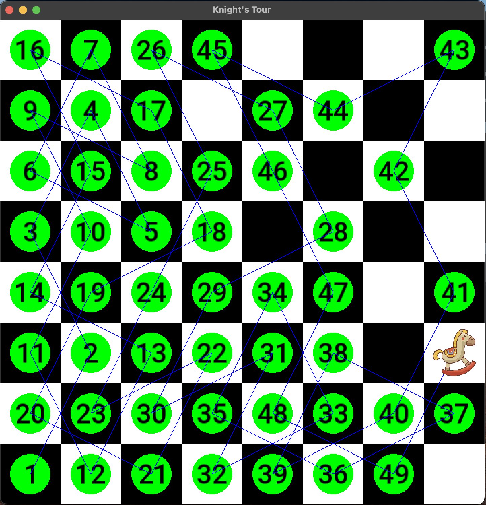

# Knight's Tour Problem

Explore the Backtracking-based solution for the Knight's Tour problem through visual representation, utilizing the [SFML](https://www.sfml-dev.org) multimedia library.



## How to run it

Make sure [CMake](https://cmake.org) and [SFML](https://github.com/SFML/SFML) are installed on your system.

Run the following command to execute the code:

1. Build the code
```
mkdir build
cd build
make
```
2. Run 
With testcase
```
./KnightTour < ../testcases/test1/input.txt
```
or manually type the start coordinates as input.
```
./KnightTour
2 4
```